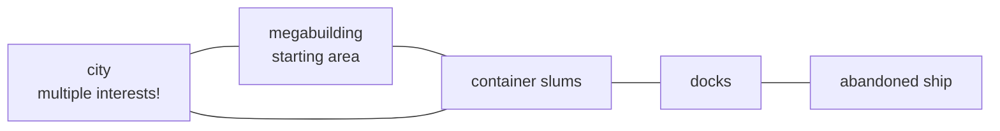

# areas

#### character amounts per area:
| area            | amount |
| --------------- | ------ |
| city            | 2      |
| megabuilding    | 2      |
| container slums | 1      |
| docks           | 1      |
| abandoned ship  | 1      |

## city

in the city, all the inhabitants are rich enough to just buy replacements for everything. therefore, there are no robot repair shops, and everything thats broken is tossed out. the trash is heavily protected, since the corporations dont want it getting in the hands of the container slums residents. 

#### exploration
- dying robots in alleys
- eyes peaking out of trash cans
- cat cafe(?)

#### romance
because the city wont unlock any other areas, it makes sense to have more dating options and content. so whereas the other areas will probably only have 1 romance option each, the city may have 2 or 3.

## megabuildings (apartments)
cyberpunk megabuilding esque. thousands of people live in it, a few shops and conviniences on the ground and middle floors.
there will be multiple megabuildings, with a few shops/company buildings inbetween. the player's character goes to work somewhere there.

#### exploration
- convenience shop

#### romance
as with the city, the megabuilding will have more romance options, as it may be a while before the player can unlock the other areas.

## container slums
when the ship was wrecked and abandoned, the poor people living outside the city found that the containers made decentish homes and shops.

#### exploration
- robot repair shop?

## docks
just some docks lol

#### exploration
- 

## abandoned ship
jericho esque, more run down than the container slums.

#### exploration
- 

---

## graph of the map

