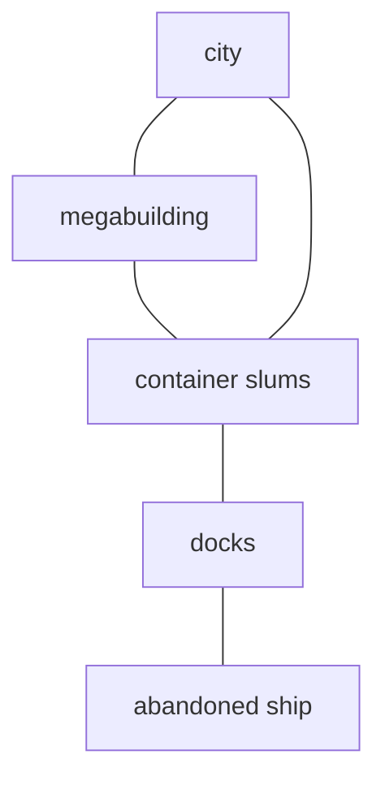

# areas

## city

## megabuilding (apartments)
cyberpunk esque

## container slums

## docks

## abandoned ship
jericho esque

```mermaid
graph TD;
  city --- megabuilding --- CS["container slums"]
  city --- CS --- docks --- AS["abandoned ship"]
```
