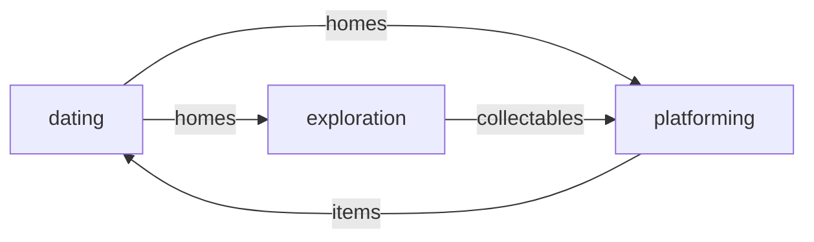

# modes of the game lol

three (3) main 'modes' of the game:
- dating sim (HUMAN)
- exploration (CAT)
- platform (CAT)

the cat will be able to play during the night, and as such will only be able to go out in the area the player is sleeping in.

## [relationships](./relationships.md)

the player will be able to date a variety of partners in each different area (likely 1 partner per area).

#### unlockable homes
in each area there will be dating options, and after having spent time with them they let you stay the night. you can bring your cat along, which will allow them to explore a new area.

#### collectables (exploration)?
depending how much content there is, it may be nice to have extra collectables given to the player by their partners that the cat can in turn give to the npcs they meet.

#### questions to answer
- how will the player meet the different partners?

## [exploration](./exploration.md)

the exploration will be the sort of 'open world' part of the game. youll be able to interact with characters (vaguely stray-ish) throughout the different areas, mainly on the human-accessible levels (ground level mainly) but potentially areas can be explored after platforming to them.

#### collectables 
in each area, there will be a certain number of collectables that, when combined, form an upgrade for the cat (mainly for platforming and aesthetic).
these will be completely optional, but may improve the player's platforming experience

#### questions to answer

## [platforming](./platform.md)

the platforming should be fun (not *too* challenging) and interesting. mainly concerned with collecting items for dating. puzzles could be fun, but it depends on how much we'd like to put in the game. 

#### collectables (dating)
the main goal of platforming is to find items for the dating part of the game. the cat finds the items and gives them to their owner, which will influence their dating life.
potentially you will not be told which person likes which items, so you can get it wrong.

#### questions to answer
- should we add puzzles?
- what sorts of jumping/movement mechanics should we have?

## linking it all together

the idea is that each part of the game will benifit another part of the game, because otherwise a player will spend too much time on some parts of the game and not on other parts of the game. this is illustrated by this pointless little diagram below:

- the dating helps you unlock homes, which allows you to explore & platform in new areas
- the platforming will unlock new items for your romantic interests (dating)
- the exploration will unlock collectables that will upgrade your platforming.

