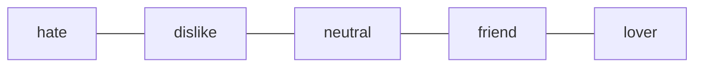

# relationships

## polyamory 
since a lot of the game will become unlocked by interacting with characters, it makes sense that the majority of your relationships will be able to co-exist. there may be some characters who wish to stay monogamous, which the player would have to decide.

## relationship scale

most characters will start on neutral, but some (particularly city) characters may start on dislike.
through the player's actions, each character will move up or down the scale. and depending on the character's stance on polyamory, they may be locked on friend unless the player decides to end their other relationships.