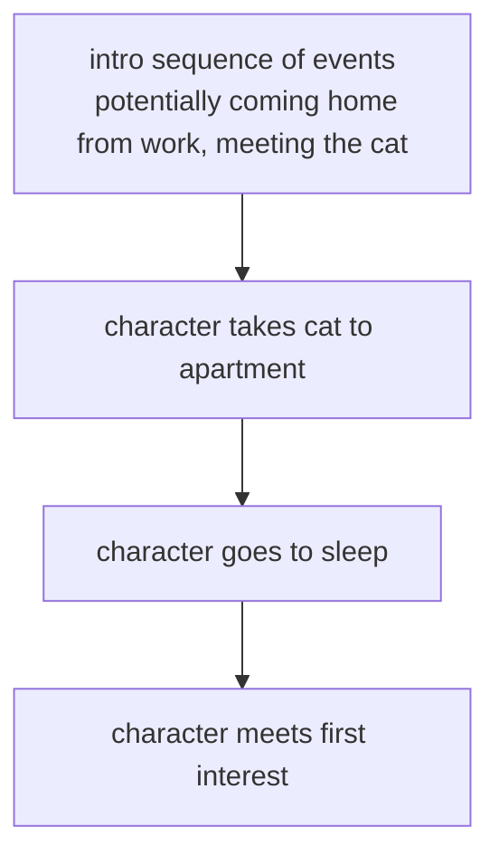

# starter progression

### intro

```mermaid 
graph TD;
  start["intro sequence of events
  potentially coming home from work, meeting the cat"]
  apartment["character takes cat to apartment"]
  sleep["character goes to sleep"]
  meet_interest["character meets first interest"]
  
  start --> apartment --> sleep --> meet_interest

```